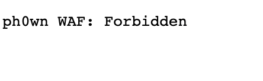
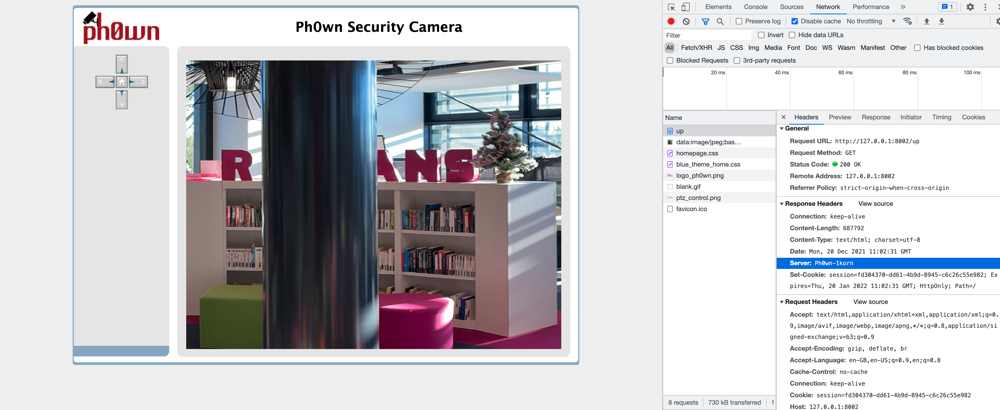

I created Ph0wn-is-watching-you for Ph0wn 2021: the write up follows the challenge flow as a normal player -and not the creator of the challenge- would do. Anyhow, I'll put some **admin comments** that reflect what I thought you should have noticed or done :)

The challenge is providing the following banner:

```
Ph0wn is watching you through its eyes but at the same time it hides a sweet secret: are you able to find it by exploring the non-explorable?

http://challenges.ph0wn.org:8002
```

If we open the page, we have an image that comes from a camera and on the left side 4 control buttons to move the camera


**The image deployed for the challenge it's only a panorama taken with a smartphone. The infrastructure was supposed to acquire live images from a camera located in the room where Ph0wn should have taken place. But, unfortunately, we had to cancel the live event**

If we try to move the camera, we notice that we cannot move the camera to reach the leftmost part of the picture.
`http://challenges.ph0wn.org:8002/left`



**Is this maybe the non-explorable area that the challenge is mentioning ?**

Let's check what happens when we perform an action that is not going left.
`http://challenges.ph0wn.org:8002/up`



It looks like that the entity that replies to our request is `Ph0wn-1korn`.
Although a bit **(deliberately)** obfuscated, the entity behing the request is quite clear: 1korn ~ gunicorn
